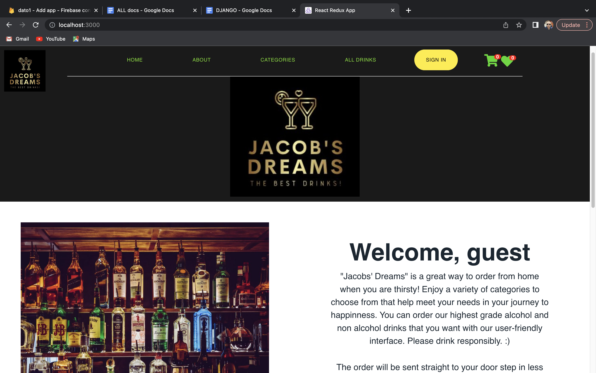
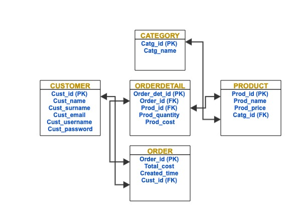

# PROJECT NAME: Drinks Online Store "Jacob's Dreams"
## by Jacob Gorelashvili
This project is a web-based online Drinks online store application. It is going to manage purchasing of alcoholic/non alcoholic drinks online on website, by adding to shopping cart and also adding to favourites of the wished products by a registered /unregistered user, and then make a checkout.
It has its own admin options when logged in via admin or staff credentials and opening relevant options for him like adding, deleting or updating products and their categories. For best experience please upload images within 700x700 pixels. Staff user can also add another staff/non staff user.

## Technologies and frameworks used in project:
-Python\
-Django\
-React\
-Redux toolkit\
-Html\
-CSS/SCSS\
-SQLite3

## Basic installation:
Project installation:
The git address for my project is:\
https://github.com/dato7777/Jacobs-Dreams.git   \
After opening your VS code, please run this command in your terminal to open project:\
  git clone https://github.com/dato7777/Jacobs-Dreams.git.  \

### Important: Please exit the main folder from the VS code and enter the inner folder "Jacob's Dreams" \
Back Installation:
1) If you have not yet installed the virtual environment package, please do so:\
    pip install virtualenv  \
2) Please make sure that you are in main folder in the terminal (outside Back and Front), then create
virtual environment:  \
    python -m virtualenv myenv   
    In case of failure, please replace word "python" with "python3".
3) Now you must activate your virtual env:
  If you are on a windows OS, please use following commands:\
    myenv\Scripts\activate \
  If you are on UNIX/MAC, please use the following for env activation:\
    source myenv/bin/activate
4) To install the requirements file, first you must enter relevant folder, in this case Back folder:\
    cd Back
5) Now you can Install the requirements.txt file running the following code:\
    pip install -r requirements.txt 
6) Tu run the Back server, please make sure you are in correct folder (Back), and then run command:\
    python manage.py runserver \
(optional) Settings file in django project folder should be configured properly, copy its contents from here:\
 https://docs.google.com/document/d/1b48OSv1bGmo_WoG_KPQORGGfU5Iun-vo8-lPtRNwMsQ/edit#heading=h.txaehsr4h6ic

Front Installation:
1) Open new terminal window for front folder, and enter it:\
  cd Front
2) And then :\
  cd my-app
  ### MY GITHUB CODE ALREADY HAS ALL NODE MODULES, SO IF YOU ALREADY HAVE NODE MODULES(CHECK IN FOLDER "FRONT/MY-APP"), PLEASE SKIP STEP 3
3) Run package installation commands one by one:\
  npm i \
  npm install axios \
  npm install react-youtube  \
  npm install @mui/icons-material  \
  npm i mdb-react-ui-kit  \
  npm install @mui/x-date-pickers \
  npm i credit-card-expiry-date  \
  npm i @mui/material @emotion/react @emotion/styled \
  npm i @material-ui/core   \
  npm config set legacy-peer-deps true \
  npm install --save react-spinners    \
  npm install react-spinner-timer --force    \
  npm i --save @fortawesome/react-native-fontawesome @fortawesome/fontawesome-svg-core react-native-svg \
  npm i bootstrap@5.2.0  \
  npm install --save react-toastify  \
  npm i jwt-decode \
  npm i gsap \

4) And finally, to run the project please run this command inside front terminal:\
  npm start  \
 
5) superuser \
username: jacob613 \
password: bengur613     

For your reference, these are my installed packages after running "npm list" command inside terminal:\
├── @emotion/react@11.10.5
├── @emotion/styled@11.10.5
├── @material-ui/core@4.12.4
├── @mui/icons-material@5.10.9
├── @mui/material@5.10.11
├── @mui/x-date-pickers@5.0.6
├── @reduxjs/toolkit@1.8.5
├── @testing-library/jest-dom@5.16.5
├── @testing-library/react@13.3.0
├── @testing-library/user-event@14.4.3
├── animate.css@4.1.1
├── axios@0.27.2
├── bootstrap@5.2.0
├── components@0.1.0
├── gsap@3.11.0
├── jwt-decode@3.1.2
├── mdb-react-ui-kit@5.0.0
├── react-dom@18.2.0
├── react-icons@4.4.0
├── react-modal-login@2.0.7
├── react-redux@8.0.2
├── react-router-dom@6.3.0
├── react-scripts@5.0.1
├── react-spinner-timer@1.1.0
├── react-spinners@0.13.6
├── react-toastify@9.0.8
├── react-youtube@10.0.0
├── react@18.2.0
├── styled-components@5.3.5
├── styled@1.0.0
└── web-vitals@2.1.4

## The website home page should look like this: \


## DATABASE
My database structure in simple words:\
Obviously this project requires databases, managed by tables. Tables must interact with each other by using one's Foreign Keys.\
Foreign keys are column names for every table. Their names should appear exactly the same way as they appear in their parent table.\
If we need to extract information from one table, it is easy to do so by using SQL query with "SELECT" command.
However, if we need to extract the information from 2 or more tables and present them somewhere, foreign keys help us a lot. 
In Django, tables are created in a folder named "models" and their respective files named "models.py".\

--The Structure of creating a table in Django:--\
``` python
    class Product(models.Model):
            user =models.ForeignKey(User,on_delete=models.SET_NULL,null=True)
            desc = models.CharField(max_length=50,null=True,blank=True)
            price = models.DecimalField(max_digits=5,decimal_places=2)
            createdTime=models.DateTimeField(auto_now_add=True)
            _id=models.AutoField(primary_key=True,editable=False)
          fields =['_id','desc','price']
            def __str__(self):
     	        return self.desc 
```
As we see in the above table creation sample, every table has its primary key "PK", and it could also have Foreign key "FK", as in the sample above. \
Above, "user" is the FK, which means that "user" column from the "User" table and "user" column from "Product" table are interconnected, joined.\
So from now on, we can extract information from both tables, as they are already joined and communicating.
### This way, I am going to create as many tables as I need, so that all tables are joined and I can extract any needed info as per my request.


